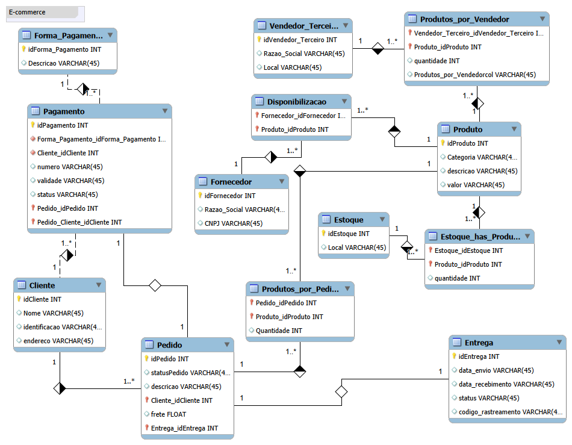

# DIO - Modelagem de Banco de Dados - E-commerce
Projeto de refinamento de modelo conceitual para sistema de e-commerce, desenvolvido durante a formação SQL Database Specialist da Digital Innovation One (DIO).

## 📋 Sobre o Projeto
Este projeto consiste na modelagem e implementação de um banco de dados relacional para um sistema de e-commerce, baseado no diagrama Entidade-Relacionamento desenvolvido. O modelo contempla todo o ciclo de vendas, desde o cadastro de clientes até o rastreamento de entregas.

## 🎯 Requisitos do Desafio Atendidos
✅ Clientes PF e PJ: Separação através do atributo _identificacao_ na tabela Cliente

✅ Múltiplas formas de pagamento: Tabela Pagamento relacionada a Pedido

✅ Sistema de entregas: Tabela Entrega com status e código de rastreamento

## 📊 Modelo Conceitual

O diagrama acima representa todas as entidades e seus relacionamentos no sistema de e-commerce.

# Autoria:
Caike Thiago Santos (**Caike Sannto**)

LinkedIn: https://www.linkedin.com/in/ctscaike/

GitHub: @ctscaike
